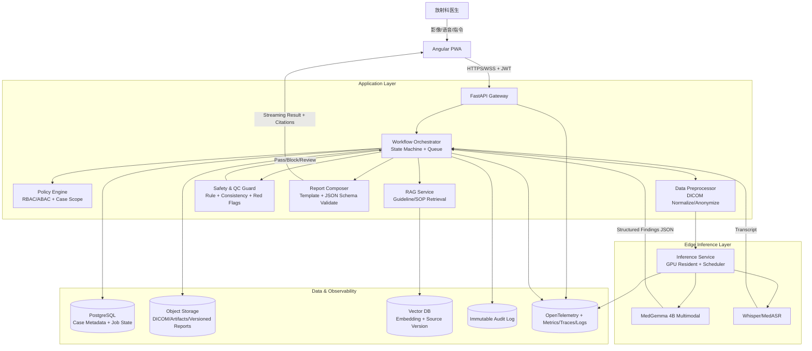

# MedGemma Edge Agent - Architecture v3.0 (Production Blueprint)

## 1. 目标与范围
本系统面向放射科随访场景，提供本地化、多模态（影像 + 语音 + 文本）的 AI 辅助分析能力。核心目标如下：
- 可信输出：所有结论可追溯、有证据链、可被人工复核。
- 边缘优先：在 RTX 4060 级设备上稳定运行，弱网或离线可用。
- 合规与安全：满足医疗数据最小权限、审计留痕和脱敏要求。
- 工程可运营：具备监控告警、灰度发布、回滚和故障恢复能力。

非目标（当前阶段）：
- 不做跨院区实时联邦学习。
- 不做全自动诊断闭环，最终决策始终由医生确认。

## 2. 架构原则
- 分层解耦：UI、网关、编排、推理、存储、治理分层独立演进。
- 明确契约：服务间通信使用版本化 API/Schema，拒绝隐式字段。
- 失败可恢复：所有异步任务具备幂等键、重试策略和死信处理。
- 默认安全：鉴权、加密、审计、脱敏作为默认路径而不是补丁。

## 3. 系统总览

## 4. 组件职责与边界

### 4.1 API Gateway (FastAPI)
- 统一入口：REST + WebSocket 流式返回。
- 鉴权鉴别：OIDC/JWT、短时令牌、设备指纹校验。
- 流量治理：限流、请求大小限制、会话超时、熔断。

### 4.2 Workflow Orchestrator
- 以 `case_id` 和 `job_id` 驱动状态机。
- 每个任务都包含 `idempotency_key`，重复请求不重复执行。
- 重试分层：瞬时错误指数退避，业务错误立即失败并进入人工队列。
- 死信队列（DLQ）：超过重试阈值的任务进入可追踪待处理池。

### 4.3 Data Preprocessor
- DICOM 解析、窗宽窗位标准化、必要匿名化。
- 预处理输出固定张量格式，附带处理参数用于审计复现。

### 4.4 Inference Service
- GPU 常驻模型，支持请求队列和批窗口调度。
- OOM 保护：显存水位阈值 + 降级策略（缩批、排队、拒绝）。
- 模型版本可热切换，失败自动回退上一稳定版本。

### 4.5 RAG Service
- 检索对象包含指南版本、生效日期、来源机构、段落定位。
- 召回结果统一打分，低于阈值触发“证据不足”路径而非强行回答。

### 4.6 Safety & QC Guard
- 规则引擎：禁忌词、冲突结论、缺失关键指标等硬约束。
- 一致性检查：影像结论、语音补充、历史报告三方交叉验证。
- 输出级别：`pass`、`review_required`、`blocked`。

### 4.7 Report Composer
- 仅接受 Schema 合法输入，自动填充引用来源与不确定性说明。
- 产出结构化 JSON + 医生可读报告模板（中文优先）。

## 5. 数据模型与存储策略
- PostgreSQL：病例元数据、任务状态、权限映射、版本索引。
- Object Storage：DICOM 原始文件、派生图像、报告快照（版本不可变）。
- Vector DB：向量索引 + 文档版本元信息（支持回溯到原文）。
- Immutable Audit Log：关键动作签名写入，不允许覆盖更新。

建议关键表（最小集合）：
- `cases(case_id, patient_pseudo_id, status, created_at, updated_at)`
- `jobs(job_id, case_id, stage, state, retry_count, idempotency_key, error_code)`
- `reports(report_id, case_id, model_version, schema_version, qc_status, object_uri)`
- `citations(report_id, source_id, source_version, section_ref, score)`

## 6. 安全与合规基线
- 传输安全：全链路 TLS，服务间建议 mTLS。
- 访问控制：RBAC + ABAC（科室、角色、病例归属、时间窗）。
- 数据最小化：默认脱敏，非必要字段不出网关。
- 密钥管理：密钥轮换、最小可见范围、环境隔离。
- 审计要求：登录、查询、导出、推理、复核、发布全记录。

## 7. 可观测性与 SLO
- 指标：
  - `P95 end-to-end latency <= 8s`（常规病例）
  - `P99 gateway error rate < 1%`
  - `QC block/review ratio`（按科室和模型版本分组）
  - `GPU memory watermark` 与队列积压深度
- 追踪：通过 OTel 贯通 `api -> orchestrator -> preproc -> inference -> qc -> report`。
- 告警：延迟、错误率、OOM、检索命中率异常、审计写入失败。

## 8. 失败处理与降级策略
- 模型服务不可用：进入“仅检索 + 历史对比”模式，显式提示 AI 推理降级。
- 向量库不可用：允许基础报告流程继续，但标记“无指南引用”。
- QC 失败：禁止自动出具最终结论，转人工复核并保留上下文。
- 存储故障：写路径快速失败，读路径保持只读服务能力。

## 9. 交付与发布策略
- 环境：`dev / staging / prod` 三环境隔离，配置不可混用。
- 发布：模型与规则分开版本化，支持 canary（5% -> 25% -> 100%）。
- 回滚：任意版本 1 步回退（模型、规则、模板独立回退）。
- 兼容：API 向后兼容至少 2 个小版本周期。

## 10. 测试策略
- 单元测试：预处理、规则引擎、Schema 校验、权限判断。
- 集成测试：端到端病例流，覆盖成功、重试、DLQ、人工复核。
- 回归测试：固定金标准病例集，比较模型版本差异。
- 混沌演练：模拟 GPU OOM、存储超时、向量库故障、网络抖动。

## 11. 实施路线图
1. M1（2-3 周）：补齐编排幂等、DLQ、Schema 校验、审计日志。
2. M2（2-4 周）：迁移 PostgreSQL + Object Storage，接入 OTel 全链路。
3. M3（2-3 周）：上线 QC 分级策略、RAG 引用回溯、降级与回滚。
4. M4（持续）：灰度优化、阈值调优、医生反馈闭环和质量看板。

## 12. 当前版本决策记录
- 推理主干：MedGemma 4B Multimodal（Edge 优先）。
- 前端：Angular PWA（便于院内终端统一分发）。
- 编排与网关：Python/FastAPI（开发效率与生态平衡）。
- 核心原则：医生在环（Human-in-the-loop）不变。
